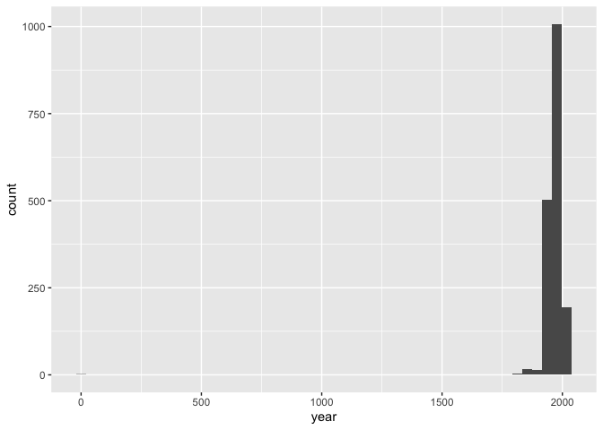
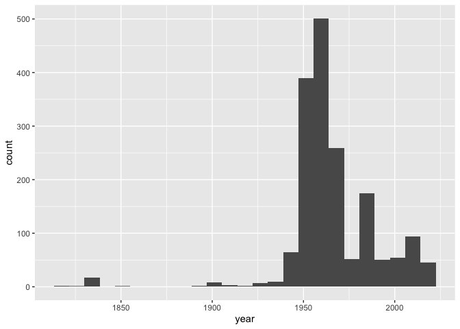

Lab 08 - University of Edinburgh Art Collection
================
Lilly McClendon
03.31.2025

## Load Packages and Data

``` r
library(tidyverse) 
library(rvest)
```

``` r
# Remove eval = FALSE or set it to TRUE once data is ready to be loaded
uoe_art <- read_csv("data/uoe-art.csv")
```

## Exercise 10

Separating the title and the date from the title column:

``` r
uoe_art <- uoe_art %>%
  separate(title, into = c("title", "date"), sep = "\\(") %>%
  mutate(year = str_remove(date, "\\)") %>% as.numeric()) %>%
  select(title, artist, year, date)
```

    ## Warning: Expected 2 pieces. Additional pieces discarded in 48 rows [26, 257, 297, 488,
    ## 499, 644, 675, 757, 936, 1085, 1087, 1095, 1193, 1227, 1230, 1284, 1337, 1347,
    ## 1413, 1537, ...].

    ## Warning: Expected 2 pieces. Missing pieces filled with `NA` in 696 rows [6, 8, 19, 28,
    ## 32, 37, 40, 44, 45, 46, 47, 50, 63, 67, 69, 77, 79, 82, 84, 89, ...].

    ## Warning: There was 1 warning in `mutate()`.
    ## ℹ In argument: `year = str_remove(date, "\\)") %>% as.numeric()`.
    ## Caused by warning in `str_remove(date, "\\)") %>% as.numeric()`:
    ## ! NAs introduced by coercion

The warnings mean that there are parts that are not numeric like unknown
or possibly. We’re okay with leaving the warnings in because our aim is
to capture the year when it is convenient to do so, and if it says
unknown or has extraneous information that is not a number we don’t care
because we are looking for the year which is numeric data.

## Exercise 11

``` r
library(skimr)
skim(uoe_art)
```

|                                                  |         |
|:-------------------------------------------------|:--------|
| Name                                             | uoe_art |
| Number of rows                                   | 3312    |
| Number of columns                                | 4       |
| \_\_\_\_\_\_\_\_\_\_\_\_\_\_\_\_\_\_\_\_\_\_\_   |         |
| Column type frequency:                           |         |
| character                                        | 3       |
| numeric                                          | 1       |
| \_\_\_\_\_\_\_\_\_\_\_\_\_\_\_\_\_\_\_\_\_\_\_\_ |         |
| Group variables                                  | None    |

Data summary

**Variable type: character**

| skim_variable | n_missing | complete_rate | min | max | empty | n_unique | whitespace |
|:--------------|----------:|--------------:|----:|----:|------:|---------:|-----------:|
| title         |         0 |          1.00 |   0 |  95 |     5 |     1629 |          0 |
| artist        |       111 |          0.97 |   2 |  55 |     0 |     1198 |          0 |
| date          |       696 |          0.79 |   3 |  70 |     0 |      418 |          0 |

**Variable type: numeric**

| skim_variable | n_missing | complete_rate |    mean |    sd |  p0 |  p25 |  p50 |  p75 | p100 | hist  |
|:--------------|----------:|--------------:|--------:|------:|----:|-----:|-----:|-----:|-----:|:------|
| year          |      1575 |          0.52 | 1964.56 | 53.14 |   2 | 1953 | 1962 | 1977 | 2020 | ▁▁▁▁▇ |

111 pieces have artist information missing and 1575 pieces have year
information missing.

## Exercise 12

``` r
library(ggplot2)
ggplot(uoe_art, aes(x = year)) + 
  geom_histogram(bins = 50)
```

    ## Warning: Removed 1575 rows containing non-finite outside the scale range
    ## (`stat_bin()`).

<!-- -->

There is a value out of the ordinary which is very close to 0 while the
next earliest piece made is in the 19th century.

## Exercise 13

``` r
# Piece Death Mask in row 1413 has the title Death Mask (2) (1964) and the code above was using (2) for the year and date. The code below manually changes it to be correct.

library(dplyr)
uoe_art_corrected <- uoe_art %>% 
  mutate(year = if_else(row_number() == 1413, 1964, year))

min(uoe_art_corrected$year, na.rm = TRUE)
```

    ## [1] 1819

``` r
max(uoe_art_corrected$year, na.rm = TRUE)
```

    ## [1] 2020

``` r
library(ggplot2)
ggplot(uoe_art_corrected, aes(x = year)) + 
  geom_histogram(bins = 25)
```

    ## Warning: Removed 1575 rows containing non-finite outside the scale range
    ## (`stat_bin()`).

<!-- -->

Our code did not originally capture the correct year information because
it was looking at the first parentheses and this piece had two sets of
parentheses in the title.

## Exercise 14

``` r
library(dplyr)
uoe_art_corrected %>% 
  count(artist)%>%
  arrange(desc(n))
```

    ## # A tibble: 1,199 × 2
    ##    artist               n
    ##    <chr>            <int>
    ##  1 Unknown            373
    ##  2 Emma Gillies       175
    ##  3 <NA>               111
    ##  4 Ann F Ward          23
    ##  5 John Bellany        22
    ##  6 Zygmunt Bukowski    21
    ##  7 Boris Bućan         17
    ##  8 Marjorie Wallace    17
    ##  9 Gordon Bryce        16
    ## 10 William Gillon      16
    ## # ℹ 1,189 more rows

The most commonly featured artist in the collection is Emma Gillies. I
have never heard of Emma Gillies before, but it seems logical the most
pieces in the collection would be from her as she studied at the
Edinburgh College of Art. Her brother (also an artist) had served as the
Director of the Edinburgh College of Arts. As Emma Gillies passed away
at a young age, it seems that her brother may have donated her pieces so
that they could be viewed and her work recognized.

<https://www.royalscottishacademy.org/exhibitions/44-emma-gillies-potter-muse/overview/>

<https://www.royalscottishacademy.org/artists/408-sir-william-gillies-rsa/overview/>

## Exercise 15

``` r
library(stringr)
library(dplyr)

count_title_includes_child <- sum(str_detect(uoe_art_corrected$title, regex("child\\b", ignore_case = TRUE)))

count_title_includes_children <- sum(str_detect(uoe_art_corrected$title, regex("child", ignore_case = TRUE)))

print(count_title_includes_child)
```

    ## [1] 9

``` r
print(count_title_includes_children)
```

    ## [1] 11

9 pieces have the word Child or Child’s in the title. 2 pieces have the
word children in the title making a total of 11 pieces that have the
word Child, Child’s, Children, or Children’s in the title.
